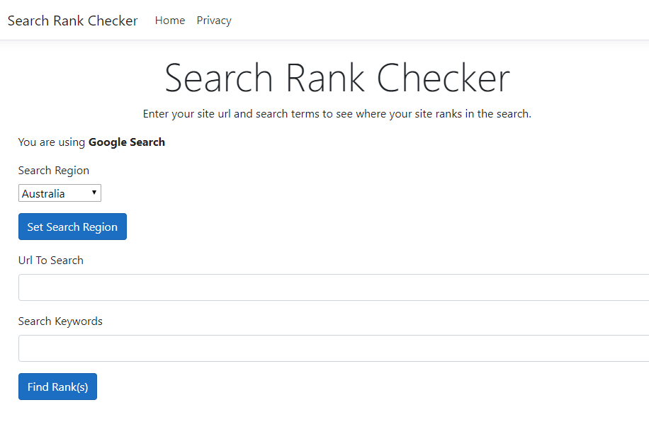
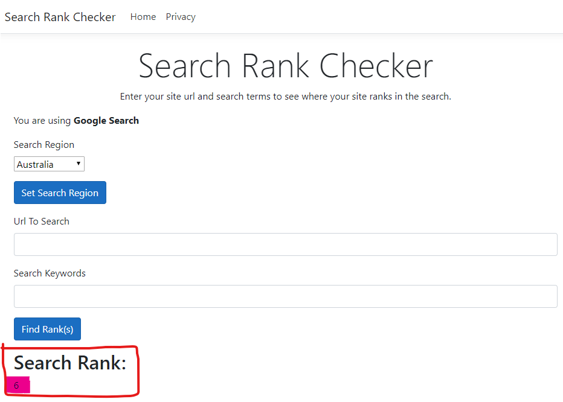
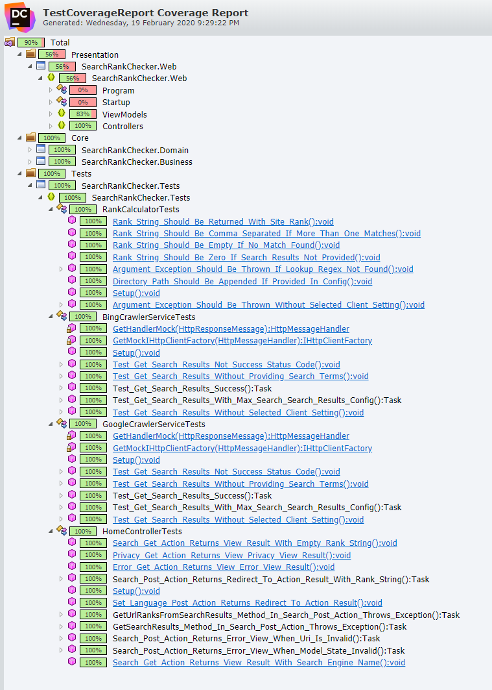

# Search Rank Checker

[](https://dev.azure.com/SearchRankChecker/MyProject/_build/latest?definitionId=1&branchName=master)

## Description

Search Rank Checker is an Asp.Net Core MVC based application designed to do google search for checking the rank of any given url for the search keywords provided.

## Requirements

User should be able to enter the desired url and the keywords in the given UI. Clicking search will get the search results from Google and calculate the rating or position in the search. It will then be shown as a string on the UI.

## Programming Language / Technology Used

- .Net Core 3.1
- Asp.Net Core MVC 3.1
- C#
- NUnit
- Moq

## UI






## Crawling Google Search

When we started to hit google search initially via HttpClient, it gave us a sort of transormed html where all the class names were encoded and the html structure was bit different. Then we figured out that we should be sending a **User-Agent** to tell google we are a browser. Once we did that, we started to get the html structure similar to what we were getting when directly using Google Chrome.

Next problem was to figure out how to extract the required data out of the raw string. After some searching, we found a very good regex to match the results within the search result's raw string.

After getting the desired search results, next was to find the url user provided via the UI and store the position of the match.

Next we just return the results to the client.

## Some Challenges

### Data Disappear On Posting Form

If we had more time, we could have probably replaced the partial view with **ViewComponent** so it can have its own class and logic like having default values and retaining form data after POST. Also, result string for showing rank could also be passed via the view model.

### Google Search and Region

Even when we are using <http://google.com.au> as the search engine url, the results returned by Google Search is New Zealand based. We are currently resolving this issue by adding australia at the end of the search keywords as seen in the attached image.

We attempted to override the Culture and UI Culture of the default thread by adding the dropdown on the UI (See Screenshot) and the code below:

```csharp
[HttpPost]
public IActionResult SetLanguage(SearchViewModel searchViewModel)
{
    // Set Culture
    CultureInfo newCulture = new CultureInfo(searchViewModel.SearchRegion);

    CultureInfo.DefaultThreadCurrentCulture = newCulture;
    CultureInfo.DefaultThreadCurrentUICulture = newCulture;
    CultureInfo.CurrentCulture = newCulture;
    CultureInfo.CurrentUICulture = newCulture;

    return RedirectToAction(nameof(Index), new SearchViewModel
    {
        SearchRegion = Thread.CurrentThread.CurrentCulture.Name
    });
}
```

The region gets changed successfully but still no luck with the google search. We tried similar thing at other places in the code like when setting up the HttpClient or HttpRequestMessage.

We also tried sending in Accept-Language header with the request but again no luck.

We tried another option, which was a brute force method you can say. And that was changing the Region and Language of our Windows 10 machine. Luckily it works. But we noted that the order of the returned results are different that what we get via the browser so we get incorrect rank basically.

So the only thing works is the word **"australia"**. We can also match the result from the browser results.

## Test Coverage



Current code coverage is **90%** which is good we thing but can definitly be improved.

## Configuration Options

### Switching Search Client

Multiple clients can be added via appSettings.json's **HttpClients** config entry. Currently, we support Google Search and Bing. Search client can be set via **SelectedHttpClient** config. (See screenshots below):

#### Google Search


#### Bing Search


Note: Application restart is necessary while running in debug mode through Visual Studio but might not be necessary if deployed on IIS.

#### LookupRegex

**LookupRegex** is used to match and extract out all the urls from the search results (10, 100 etc)

#### SearchDefaults -> DirectoryPath

**DirectoryPath** is used to match the exact url from the urls received through search

#### MaxSearchResults

MaxSearchResults is used to tell Google Search how many results we want to see on one page or in one go. Google supports 10, 20, 30, 40, 50 and 100. So we should set **MaxSearchResults** config to any of these or else you will get the default 10 results

## Author

Abul Hasan Lakhani

## Date

18th Feb 2020
